# DoorControllerX

## Goals
- 設計一個可以控制2個門(主/副)以及1個門鎖的控制器
- 主/副門馬達及門鎖採用TI DRV8242 驅動器控制, 驅動器透過繼電器控制馬達及門鎖
- 主門由獨立的驅動器驅動
- 副門及門鎖共用一個驅動器
- 主門及副門具備原點偵測(數位訊號)及位置感測器(類比訊號)
- 門鎖具備上鎖及解鎖位置偵測(數位訊號)
- 主門/副門採用PID位置計算控罝PWM輸出
- 門鎖採用PWM定值控制, 最大50%輸出

## 硬體平台及工具鏈
- MCU AT32F413R
- 馬達驅動IC: TI DRV8242, 採用EN(PWM)/PH(DIR) 控制
- 開發環境: AT32IDE/FreeRTOS/AT32 STL
- 主要週邊: PWM/UART/ADC

## 定義
- 主門馬達(M1)
- 主門位置感測(M1_POT)
- 主門原點感測(M1_HOME)
- 副門馬達(M2)
- 副門位置感測器(M2_POT)
- 副門原點感測器(M2_HOME)
- 電鎖x1(M3)
- 電鎖下鎖感測器(M3_LL)
- 電鎖解鎖感測器(M3_UL)
- 蜂鳴器(BZ1)
- 開門動作觸發(TG_OPEN)
- 關門動作觸發(TG_CLOSE)
- 開門完成輸出(OUT_OPENDONE)
- 關門完成輸出(OUT_CLOSEDONE)
- 4-bit DIP Switch功能設定(DIP[0:3])
- 通訊(UART1)

## 接腳定義

| PIN | Function | ASSIGN TO| 
| -------- | -------- | -------- | 
| PA0     | Analog |D1 current feedback (DRV8242)     | 
| PA1     | Analog |D2 current feedback (DRV8242)    | 
| PA2     | PWM, TIM5 CH3 | D2 EN | 
| PA3     | Digital Out |D2 PH     | 
| PA4     | Digital Out |SPI1_CS     | 
| PA5     | Digital Out |D2 DrvOff, active high     | 
| PA6     | Analog |POT3     | 
| PA7     | Digital Out |D2 nSLEEP, active low     | 
| PA8     | Digital Out |Buzzer, Active high | 
| PA9     | Digital Out |UART1_TX | 
| PA10    | Digital In  |UART1_RX | 
| PA11    | Digital In  |DIP_1| 
| PA12    | Digital In  |DIP_0| 
| PA15    | Digital Out |SPI3_CS     | 
| PB0     | Analog |M1_POT| 
| PB1     | Analog |M2_POT| 
| PB2    | Reserved  |---  | 
| PB3     | Digital In  |M2_HOME   | 
| PB4     | Digital Out |D1 DrvOff, active high | 
| PB5     | Digital Out |D1 nSLEEP, active low     | 
| PB6     | PWM,TIM4 CH1 | D1 EN | 
| PB7     | Digital Out |D1 PH     | 
| PB8     | Digital | IIC1_SCL     | 
| PB9     | Digital | IIC1_SDA     | 
| PB10    | Digital In  |M1_HOME   | 
| PB11    | Digital In  |TEST   | 
| PB12    | Reserved  |---  | 
| PB13    | Reserved  |---  | 
| PB14    | Digital Input |DIP_2| 
| PB15    | Digital Input |DIP_3| 
| PD2     | Digital Out |LED, Active high     | 
| PC0     | Digital Input |M3_LL, active low     | 
| PC1     | Digital Input |M3_UL, active low     | 
| PC2     | Digital Output |OPEN_DONE, active high| 
| PC3     | Digital Output |CLOSE_DONE, active high| 
| PC4     | Digital Output |IDO_2, active high| 
| PC5     | Digital Input |TG_OPEN     | 
| PC6     | Digital Input |TG_CLOSE     | 
| PC7     | Digital Out |R1 Relay Control, active high     | 
| PC8     | Digital Out |R2 Relay Control, active high     | 
| PC9     | Digital Out |R3 Relay Control, active high     | 
| PC10    | SPI | SPI3_CLK| 
| PC11    | SPI | SPI3_MISO | 
| PC12    | SPI | SPI3_MOSI | 
| PD2     | Digital Out |LED1    | 

## DIP SWITCH 功能
- DIP_0: 正轉(D1 PH=1, D2 PH=0)/反轉(D1 PH=0, D2 PH=1) (0/1)
- DIP_1: 無電鎖(0)/有電鎖(1), 電鎖上鎖:D2 PH=1, 解鎖:D2 PH=0
- DIP_2: 只使用M1(0), 同時使用M1/M2(1)
- DIP_3: 未使用

### 補充方向說明
- M1/M2 運行方向與POT關係

|DIP_0| M1  | POT1 |  M2 |POT2 |
| --- | --- | ---  | --- | --- |
| 0   | FWD | 遞增 | FWD | 遞減 | 
| 1   | FWD | 遞減 | FWD | 遞增 | 

- 調整在M1/M2 到達原點時, POT1/2的讀值需落在150 ~ 210度之間以方便對位
- 在每次關門後檢查POT 是否落在150~210之間, 若不在這個範圍內需要發出警報

## 控制

### 上電流程
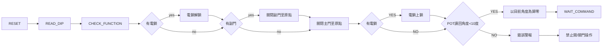

### 馬達驅動程序
D1/D2 : 驅動IC(DRV8242)
R1/R2/R3: 繼電器
M1/M2: 主門/副門驅動電機, 使用PID做位置控制
M3: 電鎖電機, PWM控制, 單一設置輸出, 僅控制方向及PWM DUTY, 作動時間.

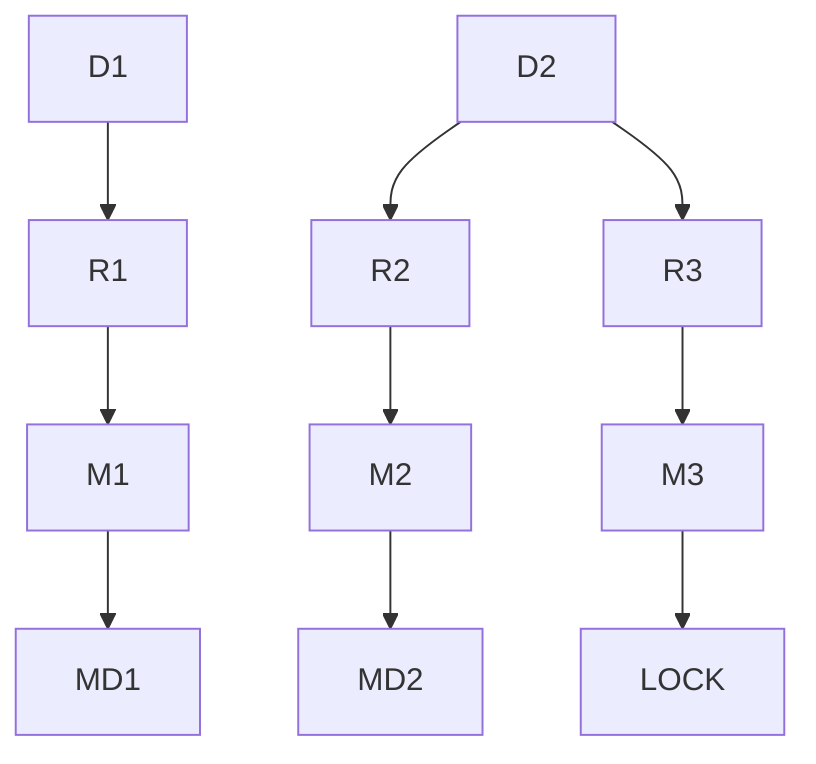

### 馬達操作程序:
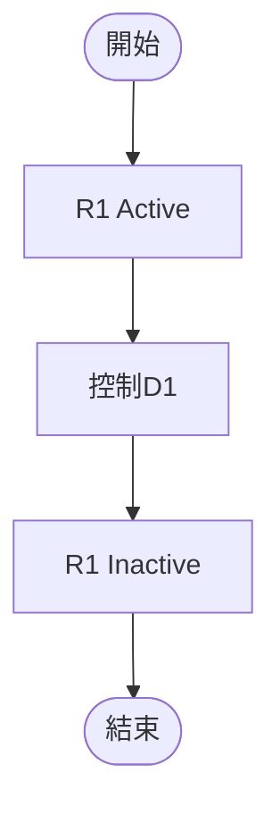
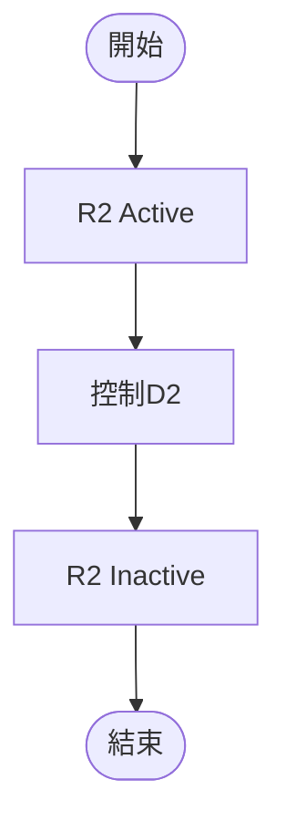
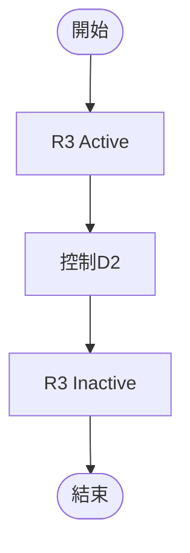

## 門扇控制流程 - 主門開啟
### 無電鎖
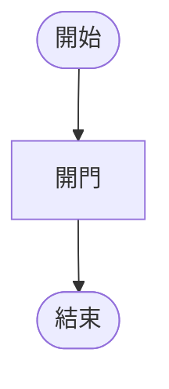

### 有電鎖
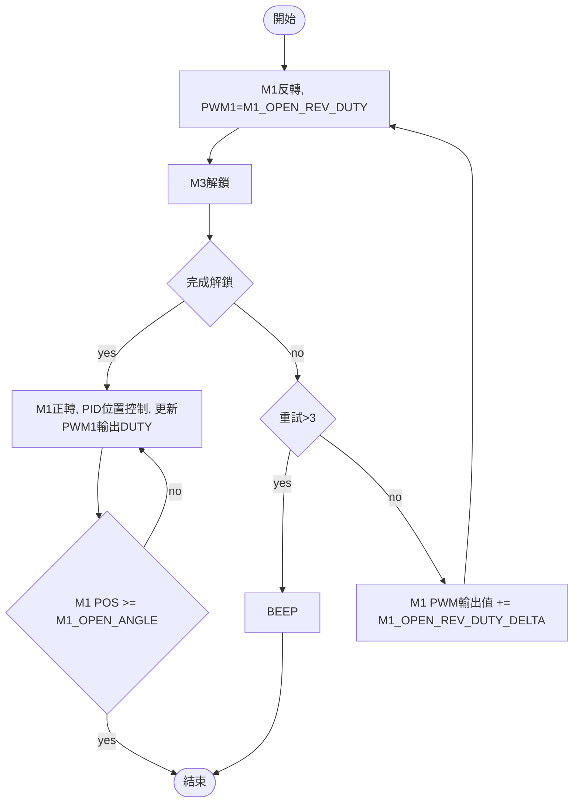
## 門扇動作流程 - 主門關閉
### 無電鎖
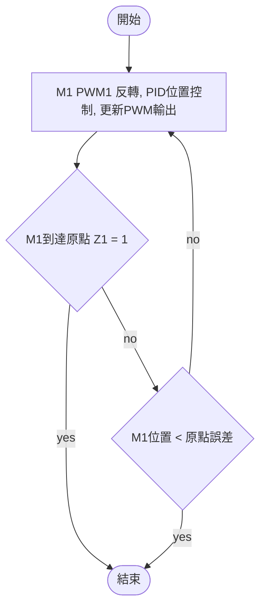

### 有電鎖
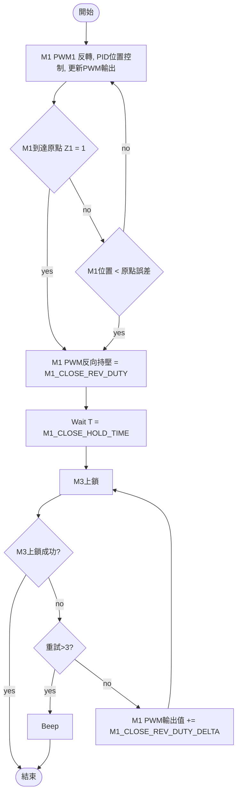

### 門扇動作流程 - 副門開啟
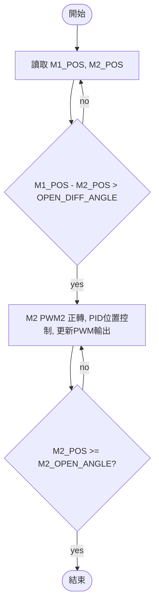
### 門扇動作流程 - 副門關閉
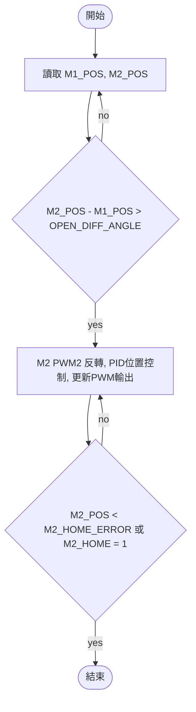

### 門扇動作流程 - 阻擋
在門扇(M1/M2)運作的過程中需判斷阻擋(由T1->T2(BLOCK_DETECT_TIME)運行角度增量<BLOCK_DETECT_ANGLE)

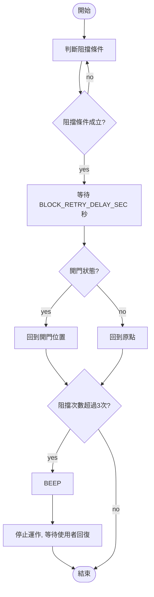

## 電鎖流程
- 電鎖在執行上鎖/解鎖控制後, 需等待LOCK_ACTIVE_TIME後才可執行下一個程序, LOCK_ACTIVE_TIME的單位為0.1秒
- 電鎖馬達M3驅動時只控制方向, 輸出數值階為M3_START_DUTY, 不得超過M3_MAX_DUTY

### 電鎖錯誤
- 上鎖後 M3_LL 未偵測到位
- 下鎖後 M3_UL 未偵測到位
- 上/下鎖後 M3_LL/M3_UL 偵測錯位

### 上電自檢錯誤碼 (LD_ERROR_CODE)
| 錯誤碼 | 說明 |
| --- | --- |
| 0 | 無錯誤 |
| 1 | 阻擋重試次數超過上限 |
| 2 | 操作逾時 (超過 MAX_OPEN_OPERATION_TIME) |
| 3 | 執行中電鎖解鎖失敗 |
| 4 | 執行中電鎖上鎖失敗 |
| 10 | 上電解鎖方向/感測檢查失敗 |
| 11 | 副門 VR 與運轉方向不一致 |
| 12 | 副門回原點逾時 |
| 13 | 副門原點開關異常 |
| 14 | 主門 VR 與運轉方向不一致 |
| 15 | 主門回原點逾時 |
| 16 | 主門原點開關異常 |
| 17 | 上電上鎖方向/感測檢查失敗 |
| 18 | 主門 POT 角度異常 (角度<30或>330) |
| 19 | 副門 POT 角度異常 (角度<30或>330) |

### M1/M2 POT to POS 轉換
- M1_POS = M1_POTx360/4096
- M2_POS = M2_POTx360/4096

### M1/M2 工作電流轉換(ignored)

### M1/M2 PWM 輸出(%), 在PID運算後需依設定限制上/下限值
- M1 輸出起始值: M1_START_DUTY
- M1 輸出最大值: M1_MAX_DUTY
- M2 輸出起始值: M2_START_DUTY
- M2 輸出最大值: M2_MAX_DUTY

## 狀態機
- 系統需以狀態機的模型運作, 以確保固定運算週期.
- 狀態機週期為 TIME_WINDOW, 單位為ms.

## 通訊
- 通訊採用UART1, 預設115200 N81N
- 協定採用Binary Protocol
- 參考
    - reference\bin_protocol_lite.c/h
    - refrernce\database.c/h

## EEPROM參數 (DF_)
- 使用MCU Flash 做為資料儲存空間
- 參考
    - reference\at32_common\

| 名稱 | 型態 | 最小值 | 最大值| 預設值 |說明|
| -------- | -------- | -------- | --- | --- | --- |
| BLOCK_RETRY_DELAY_SEC | U8 | 1  | 10| 1 | 門扇被阻擋時, 重試延遲時間(s) |
| OPEN_TRIGGER_ANGLE | U8 | 5  | 30| 10 | 門扇在關閉狀態時, 當位值>設定值時執行開門動作 |
| OPEN_DIFF_ANGLE | U8 | 10  | 30| 10 | M2在開啟/關閉功能前與M1的角度差 |
| LOCK_ACTIVE_TIME | U8 | 10  | 50| 20 | M3作動時間(0.1s) |
| BLOCK_DETECT_ANGLE | U8 | 1  | 20| 2 | 判斷門扇阻擋時的角度 |
| BLOCK_DETECT_TIME | U16 | 100  | 2000| 500 | 判斷門扇阻擋時的作動時間(ms) |
| TIME_WINDOW | U8 | 1  | 20| 5 | 狀態機TIME WINDOW |
| M1_START_DUTY | U8 | 1  | 90| 20 | M1 PWM 輸出下限(%), PID輸出>0且<此值時以此值輸出 |
| M1_MAX_DUTY | U8 | 1  | 90| 80 | M1 PWM 輸出上限(%), PID輸出超過此值時以此值輸出 |
| M2_START_DUTY | U8 | 1  | 90| 20 | M2 PWM 輸出下限(%), PID輸出>0且<此值時以此值輸出 |
| M2_MAX_DUTY | U8 | 1  | 90| 80 | M2 PWM 輸出上限(%), PID輸出超過此值時以此值輸出 |
| M3_START_DUTY | U8 | 1  | 90| 30 | M3 PWM 輸出下限(%) |
| M3_MAX_DUTY | U8 | 1  | 50| 50 | M3 PWM 輸出上限(%), 不得超過50% |
| M1_OPEN_ANGLE | U8 | 50  | 120| 100 | M1開啟角度 |
| M2_OPEN_ANGLE | U8 | 50  | 120| 100 | M2開啟角度 |
| M1_OPEN_REV_DUTY | U8 | 20  | 100| 30 | M1開門前反向輸出初始值 |
| M1_OPEN_REV_DUTY_DELTA | U8 | 10  | 50| 20 | M1開門前反向輸出每次重試增值 |
| M1_CLOSE_REV_DUTY | U8 | 20  | 100| 30 | M1關門到原點後反向持壓初始輸出值 |
| M1_CLOSE_REV_DUTY_DELTA | U8 | 10  | 50| 30 | M1關門後反向持壓每次重試增值 |
| M1_CLOSE_FWD_DELAY | U8 | 0  | 10| 2 | M1關門後反向持壓等待時間(s) |
| M1_STARTUP_RELIEF_MS | U16 | 100  | 2000| 500 | 雙門上電自檢時M1機械釋壓脈衝時間(ms) |
| M1_ZERO_ERROR | U8 | 1  | 20| 5 | M1上電歸零允許誤差(度), 在此範圍內可直接以目前POT角度歸零 |
| M2_ZERO_ERROR | U8 | 1  | 20| 5 | M2上電歸零允許誤差(度), 在此範圍內可直接以目前POT角度歸零 |
| MAX_OPEN_OPERATION_TIME | U8 | 10  | 120| 25 | 最大允許開門時間 |

## 執行期參數(LD_)
| 名稱 | 型態 | 最小值 | 最大值| 預設值 |說明|
| -------- | -------- | -------- | --- | --- | --- |
| LIVE_DATA_MD_STATE | U8 | 1  | 10| 1 | 門扇被阻擋時 |
| LIVE_DATA_SD_STATE | U8 | 1  | 10| 1 | 門扇被阻擋時 |
| LIVE_DATA_AUTO_ENABLE | U8 | 1  | 10| 1 | 門扇被阻擋時 |
| LIVE_DATA_ERROR_CODE | U8 | 1  | 10| 1 | 門扇被阻擋時 |
| LIVE_DATA_SM_SUBSTATE | U8 | 1  | 10| 1 | 門扇被阻擋時 |
| LIVE_DATA_AUTO_TIMES | U16 | 1  | 10| 1 | 門扇被阻擋時 |
| LIVE_DATA_AUTO_RUNS | U16 | 1  | 10| 1 | 門扇被阻擋時 |
| LIVE_DATA_BOARD_DIR | I8 | 1  | 10| 1 | 門扇被阻擋時 |
| LIVE_DATA_BOARD_VR | I16 | 1  | 10| 1 | 門扇被阻擋時 |
| LIVE_DATA_CH1_RAW | I32 | 1  | 10| 1 | 門扇被阻擋時 |
| LD_M1_POS | U32 | 0  | 36000 | 0 | 主門目前角度, 單位為度x100 |
| LD_M2_POS | U32 | 0  | 36000 | 0 | 副門目前角度, 單位為度x100 |
| LIVE_DATA_MD_POS_SP | F32 | 1  | 10| 1 | 門扇被阻擋時 |
| LIVE_DATA_MD_POS_ERR | F32 | 1  | 10| 1 | 門扇被阻擋時 |
| LIVE_DATA_MD_SPD_PV | F32 | 1  | 10| 1 | 門扇被阻擋時 |
| LIVE_DATA_MD_SPD_SP | F32 | 1  | 10| 1 | 門扇被阻擋時 |
| LIVE_DATA_MD_SPD_ERR | F32 | 1  | 10| 1 | 門扇被阻擋時 |
| LIVE_DATA_SD_POS_PV | F32 | 1  | 10| 1 | 門扇被阻擋時 |
| LIVE_DATA_SD_POS_SP | F32 | 1  | 10| 1 | 門扇被阻擋時 |
| LIVE_DATA_SD_POS_ERR | F32 | 1  | 10| 1 | 門扇被阻擋時 |
| LIVE_DATA_SD_SPD_PV | F32 | 1  | 10| 1 | 門扇被阻擋時 |
| LIVE_DATA_SD_SPD_SP | F32 | 1  | 10| 1 | 門扇被阻擋時 |
| LIVE_DATA_SD_SPD_ERR | F32 | 1  | 10| 1 | 門扇被阻擋時 |
| LIVE_DATA_MD_CURRENT | F32 | 1  | 10| 1 | 門扇被阻擋時 |
| LIVE_DATA_SD_CURRENT | F32 | 1  | 10| 1 | 門扇被阻擋時 |

## 警報
- 使用Buzzer及LED作為錯誤輸出
- 不同的錯誤以不同的長/短音組合識別 (S = 短音 200ms, L = 長音 600ms, 音間間隔 200ms)
- 發生錯誤時, Buzzer 播放對應pattern共 **2個cycle** 後停止, LED **持續亮燈**
- 短按TEST時, 若 LD_ERROR_CODE ≠ 0, Buzzer 重播對應pattern共 **2個cycle**
- 按下TG_OPEN 或 TG_CLOSE 可清除錯誤狀態, LED熄滅

### Buzzer 音型對照表

| 錯誤碼 | 音型 | 說明 |
| --- | --- | --- |
| 1  | S | 阻擋重試超過上限 |
| 2  | S-S | 操作逾時 (超過 MAX_OPEN_OPERATION_TIME) |
| 3  | S-S-S | 執行中解鎖失敗 (開門時電鎖無法解開) |
| 4  | S-S-S-S | 執行中上鎖失敗 (關門後電鎖無法鎖上) |
| 10 | L-S | 上電解鎖方向/感測檢查失敗 |
| 11 | L-S-S | 副門 VR 與運轉方向不一致 |
| 12 | L-S-S-S | 副門回原點逾時 |
| 13 | L-S-S-S-S | 副門原點開關異常 |
| 14 | L-L-S | 主門 VR 與運轉方向不一致 |
| 15 | L-L-S-S | 主門回原點逾時 |
| 16 | L-L-S-S-S | 主門原點開關異常 |
| 17 | L-L-L | 上電上鎖方向/感測檢查失敗 |
| 18 | L-L-L-S | 主門 POT 角度異常 |
| 19 | L-L-L-S-S | 副門 POT 角度異常 |

> 記憶規則: 0個長音=執行期錯誤(短音數=碼值); 1個長音=副門/電鎖啟動問題; 2個長音=主門問題; 3個長音=上電上鎖或POT異常延伸碼

## 預期結果

- 接收"TG_Open"訊號執行開門程序
- 判斷M1_POS > OPEN_TRIGGER_ANGLE時, 執行開門程序
- 接收"TG_Close"訊號執行關門程序
- 所有程序需要MAX_OPEN_OPERATION_TIME秒內完成, 未完成需發出警報.
- 若有未列出或多餘的參數值, 請先提供建議列表後再行決定是否增減

## 待辦事項

- [x] 將上電自檢錯誤碼對照同步到 host_ui 文件
- [x] 在 Host 畫面新增上電自檢結果摘要區塊（顯示最近一次檢查狀態）
- [x] 實機驗證 DIP 組合（有無電鎖 / 單門雙門）在上電流程的分支行為
- [x] 確認 M1/M2 方向一致性檢查的脈衝時間與角度閾值在機構端穩定
- [x] 依實測結果微調上電回原點逾時參數
- [x] HOST程式在WINDOWS下, 進入'Parameters'頁面沒有返回功能
- [ ] 調整錯誤警報時間為DF參數,單位(s)
- [x] Live Data新增機械角度(POT原始讀值)
- [x] 加入POT故障視窗判定（角度<30或>330）
- [x] 雙門上電時先讓M1短暫正轉釋壓（`DF_M1_STARTUP_RELIEF_MS`，預設500ms，非預開）再測M2方向，之後依序：M2→原點、測M1方向、M1→原點
- [ ] 本輪門控功能穩定後，整理「機構特性 + 控制原則」模板文件（供後續新應用快速導入）
- [x] 發生錯誤後, 可透過長按TEST (>3秒) 或通訊清除錯誤並回到待機狀態
- [x] 自動開門/關門測試流程, 可以設定測試次數.