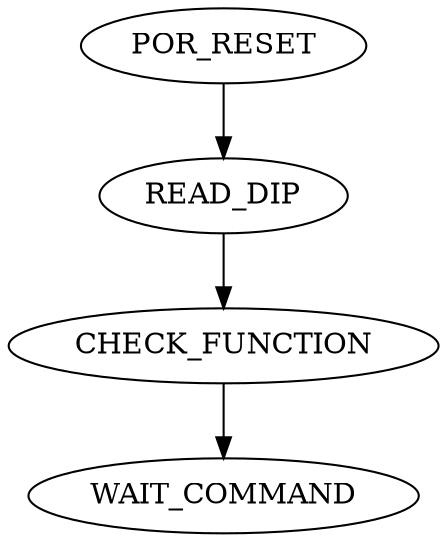
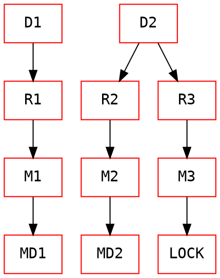

# DoorControllerX

## Goals
- 設計一個可以控制2個門(主/副)以及1個門鎖的控制器
- 主/副門馬達及門鎖採用TI DRV8242 驅動器控制, 驅動器透過繼電器控制馬達及門鎖
- 主門由獨立的驅動器驅動
- 副門及門鎖共用一個驅動器
- 主門及副門具備原點偵測(數位訊號)及位置感測器(類比訊號)
- 門鎖具備上鎖及解鎖位置偵測(數位訊號)
- 主門/副門採用PID位置計算控罝PWM輸出
- 門鎖採用PWM定值控制, 最大50%輸出

## 硬體平台及工具鏈
- MCU AT32F413R
- 馬達驅動IC: TI DRV8242, 採用EN(PWM)/PH(DIR) 控制
- 開發環境: AT32IDE/FreeRTOS/AT32 STL
- 主要週邊: PWM/UART/ADC

## 定義
- 主門馬達(M1)
- 主門位置感測(M1_POT)
- 主門原點感測(M1_HOME)
- 副門馬達(M2)
- 副門位置感測器(M2_POT)
- 副門原點感測器(M2_HOME)
- 電鎖x1(M3)
- 電鎖下鎖感測器(M3_LL)
- 電鎖解鎖感測器(M3_UL)
- 蜂鳴器(BZ1)
- 開門動作觸發(TG_OPEN)
- 關門動作觸發(TG_CLOSE)
- 開門完成輸出(OUT_OPENDONE)
- 關門完成輸出(OUT_CLOSEDONE)
- 4-bit DIP Switch功能設定(DIP[0:3])
- 通訊(UART1)


## 接腳定義

| PIN | Function | ASSIGN TO| 
| -------- | -------- | -------- | 
| PA0     | Analog |D1 current feedback (DRV8242)     | 
| PA1     | Analog |D2 current feedback (DRV8242)    | 
| PA2     | PWM, TIM5 CH3 | D2 EN | 
| PA3     | Digital Out |D2 PH     | 
| PA4     | Digital Out |SPI1_CS     | 
| PA5     | Digital Out |D2 DrvOff, active high     | 
| PA6     | Analog |POT3     | 
| PA7     | Digital Out |D2 nSLEEP, active low     | 
| PA8     | Digital Out |Buzzer, Active high | 
| PA9     | Digital Out |UART1_TX | 
| PA10    | Digital In  |UART1_RX | 
| PA11    | Digital In  |DIP_1| 
| PA12    | Digital In  |DIP_0| 
| PA15    | Digital Out |SPI3_CS     | 
| PB0     | Analog |M1_POT| 
| PB1     | Analog |M2_POT| 
| PB2    | Reserved  |---  | 
| PB3     | Digital In  |M2_HOME   | 
| PB4     | Digital Out |D1 DrvOff, active high | 
| PB5     | Digital Out |D1 nSLEEP, active low     | 
| PB6     | PWM,TIM4 CH1 | D1 EN | 
| PB7     | Digital Out |D1 PH     | 
| PB8     | Digital | IIC1_SCL     | 
| PB9     | Digital | IIC1_SDA     | 
| PB10    | Digital In  |M1_HOME   | 
| PB11    | Digital In  |TEST   | 
| PB12    | Reserved  |---  | 
| PB13    | Reserved  |---  | 
| PB14    | Digital Input |DIP_2| 
| PB15    | Digital Input |DIP_3| 
| PD2     | Digital Out |LED, Active high     | 
| PC0     | Digital Input |M3_UL     | 
| PC1     | Digital Input |M3_LL     | 
| PC2     | Digital Output |OPEN_DONE, active high| 
| PC3     | Digital Output |CLOSE_DONE, active high| 
| PC4     | Digital Output |IDO_2, active high| 
| PC5     | Digital Input |TG_OPEN     | 
| PC6     | Digital Input |TG_CLOSE     | 
| PC7     | Digital Out |R1 Relay Control, active high     | 
| PC8     | Digital Out |R2 Relay Control, active high     | 
| PC9     | Digital Out |R3 Relay Control, active high     | 
| PC10    | SPI | SPI3_CLK| 
| PC11    | SPI | SPI3_MISO | 
| PC12    | SPI | SPI3_MOSI | 
| PD2     | Digital Out |LED1    | 


## DIP SWITCH 功能
- DIP_0: 正轉(D1 PH=1, D2 PH=0)/反轉(D1 PH=0, D2 PH=1) (0/1)
- DIP_1: 無電鎖(0)/有電鎖(1), 電鎖上鎖:D2 PH=1, 解鎖:D2 PH=0
- DIP_2: 只使用M1(0), 同時使用M1/M2(1)
- DIP_3: 未使用

## 控制

### 上電流程


### 馬達驅動程序
D1/D2 : 驅動IC(DRV8242)
R1/R2/R3: 繼電器
M1/M2: 主門/副門驅動電機, 使用PID做位置控制
M3: 電鎖電機, PWM控制, 單一設置輸出, 僅控制方向及PWM DUTY, 作動時間.




### 馬達操作程序:
``` flow
st=>start: 開始
op1=>operation: R1 Active
op2=>operation: 控制D1
op3=>operation: R1 Inactive
e=>end: 結束
st->op1->op2->op3->e

```
``` flow
st=>start: 開始
op1=>operation: R2 Active
op2=>operation: 控制D2
op3=>operation: R2 Inactive
e=>end: 結束
st->op1->op2->op3->e

```
``` flow
st=>start: 開始
op1=>operation: R3 Active
op2=>operation: 控制D2
op3=>operation: R3 Inactive
e=>end: 結束
st->op1->op2->op3->e

```


## 門扇控制流程 - 主門開啟
### 無電鎖
```flow
st=>start: 開始
op1=>operation: 開門
e=>end: 結束
st->op1->e
```

### 有電鎖
```flow
st=>start: 開始
op1=>operation: M1反轉, PWM1=M1_OPEN_REV_DUTY
op2=>operation: M3解鎖
op3=>operation: M1 PWM1 += M1_OPEN_REV_DUTY_DELTA
op4=>operation: BEEP
op5=>operation: M1正轉, PID位置控制, 更新PWM1輸出DUTY
cd1=>condition: 完成解鎖
cd2=>condition: 重試>3
cd3=>condition: M1 POS >= M1_OPEN_ANGLE
e=>end: 結束
st->op1->op2->cd1
cd1(yes)->op5->cd3
cd1(no)->cd2->op3->op1
cd2(yes)->op4->e
cd2(no)->op3->op1
cd3(yes)->e
cd3(no)->op5
```
## 門扇動作流程 - 主門關閉
### 無電鎖
```flow
st=>start: 開始
op1=>operation: M1 PWM1 反轉, PID位置控制, 更新PWM輸出
cd1=>condition: M1到達原點(Z1 = 1)
cd2=>condition: M1位置<原點誤差
e=>end: 結束
st->op1->cd1
cd1(yes)->e
cd1(no)->cd2
cd2(yes)->e
cd2(no)->op1
```

### 有電鎖
```flow
st=>start: 開始
op1=>operation: M1 PWM1 反轉, PID位置控制, 更新PWM輸出
op2=>operation: M3上鎖
op3=>operation: M1 PWM1 += M1_CLOSE_FWD_DUTY_DELTA
op4=>operation: Beep
op5=>operation: M1 PWM1 = M1_CLOSE_FWD_DUTY
op6=>operation: Wait T = M1_CLOSE_FWD_DELAY
cd1=>condition: M1到達原點(Z1 = 1)
cd2=>condition: M1位置<原點誤差
cd3=>condition: M3上鎖成功?
cd4=>condition: 重試>3?
e=>end: 結束
st->op1->cd1
cd1(yes)->op5->op6
cd1(no)->cd2
cd2(yes)->op5->op6
cd2(no)->op1
cd3(yes)->e
cd3(no)->cd4->op3->op2
cd4(yes)->op4->e
cd4(no)->op3
op6->op2->cd3
```

### 門扇動作流程 - 副門開啟
``` flow
st=>start: 開始
op1=>operation: 讀取M1_POS, M2_POS
op2=>operation: 開門至設定角度
op3=>operation: M1 PWM增量
op4=>operation: BEEP
op5=>operation: M2 PWM2 正轉, PID位置控制, 更新PWM輸出
cd1=>condition: (M1_POS - M2_POS) > OPEN_DIFF_ANGLE
cd2=>condition: 重試>3
cd3=>condition: M2_POS >= M2_OPEN_ANGLE?
e=>end: 結束

st->op1->cd1
cd1(yes)->op5->cd3
cd1(no)->op1
cd3(yes)->e
cd3(no)->op5

```
### 門扇動作流程 - 副門關閉
``` flow
st=>start: 開始
op1=>operation: 讀取M1_POS, M2_POS
op2=>operation: 開門至設定角度
op3=>operation: M1 PWM增量
op4=>operation: BEEP
op5=>operation: M2 PWM2 反轉, PID位置控制, 更新PWM輸出
cd1=>condition: (M2_POS - M1_POS) > OPEN_DIFF_ANGLE
cd2=>condition: 重試>3
cd3=>condition: (M2_POS < M2_HOME_ERROR)? || M2_HOME = 1
e=>end: 結束

st->op1->cd1
cd1(yes)->op5->cd3
cd1(no)->op1
cd3(yes)->e
cd3(no)->op5
```

### 門扇動作流程 - 阻擋
在門扇(M1/M2)運作的過程中需判斷阻擋(由T1->T2(BLOCK_DETECT_TIME)運行角度增量<BLOCK_DETECT_ANGLE)

``` flow
st=>start: 開始
op1=>operation: 回到原點
op2=>operation: 回到開門位置
op3=>operation: 判斷阻擋條件
op4=>operation: BEEP
op5=>operation: 停止運作, 等待使用者回復.
op6=>operation: 等待BLOCK_RETRY_DELAY_SEC 秒
cd1=>condition: 阻擋條件成立?
cd2=>condition: 開門狀態?
cd3=>condition: 關門狀態?
cd4=>condition: 阻擋次數超過3次?
e=>end: 結束

st->op3->cd1
cd1(yes)->op6->cd2
cd1(no)->op3
cd2(yes)->op2->cd4
cd2(no)->op1->cd4
cd4(yes)->op4->op5->e
cd4(no)->e
```

## 電鎖流程
- 電鎖在執行上鎖/解鎖控制後, 需等待LOCK_ACTIVE_TIME後才可執行下一個程序, LOCK_ACTIVE_TIME的單位為0.1秒
- 電鎖馬達M3驅動時只控制方向, 輸出數值階為M3_START_DUTY, 不得超過M3_MAX_DUTY

### 電鎖錯誤
- 上鎖後 M3_LL 未偵測到位
- 下鎖後 M3_UL 未偵測到位
- 上/下鎖後 M3_LL/M3_UL 偵測錯位

### M1/M2 POT to POS 轉換
- M1_POS = M1_POTx360/4096
- M2_POS = M2_POTx360/4096

### M1/M2 工作電流轉換(ignored)

### M1/M2 PWM 輸出(%), 在PID運算後需依設定限制上/下限值
- M1 輸出起始值: M1_START_DUTY
- M1 輸出最大值: M1_MAX_DUTY
- M2 輸出起始值: M2_START_DUTY
- M2 輸出最大值: M2_MAX_DUTY

## 狀態機
- 系統需以狀態機的模型運作, 以確保固定運算週期.
- 狀態機週期為 TIME_WINDOW, 單位為ms.

## 通訊
- 通訊採用UART1, 預設115200 N81N
- 協定採用Binary Protocol
- 參考
    - reference\bin_protocol_lite.c/h
    - refrernce\database.c/h

## EEPROM參數 (DF_)
- 使用MCU Flash 做為資料儲存空間
- 參考
    - reference\at32_common\


| 名稱 | 型態 | 最小值 | 最大值| 預設值 |說明|
| -------- | -------- | -------- | --- | --- | --- |
| BLOCK_RETRY_DELAY_SEC | U8 | 1  | 10| 1 | 門扇被阻擋時, 重試延遲時間(s) |
| OPEN_TRIGGER_ANGLE | U8 | 5  | 30| 10 | 門扇在關閉狀態時, 當位值>設定值時執行開門動作 |
| OPEN_DIFF_ANGLE | U8 | 10  | 30| 10 | M2在開啟/關閉功能前與M1的角度差 |
| LOCK_ACTIVE_TIME | U8 | 10  | 50| 20 | M3作動時間(0.1s) |
| BLOCK_DETECT_ANGLE | U8 | 10  | 20| 10 | 判斷門扇阻擋時的角度 |
| BLOCK_DETECT_TIME | U8 | 10  | 20| 10 | 判斷門扇阻擋時的作動時間 |
| TIME_WINDOW | U8 | 1  | 20| 5 | 狀態機TIME WINDOW |
| M1_START_DUTY | U8 | 1  | 90| 20 | M1啟動 DUTY CYCLE |
| M1_MAX_DUTY | U8 | 1  | 90| 20 | M1輸出最大 DUTY CYCLE |
| M2_START_DUTY | U8 | 1  | 90| 20 | M1啟動 DUTY CYCLE |
| M2_MAX_DUTY | U8 | 1  | 90| 20 | M1輸出最大 DUTY CYCLE |
| M3_START_DUTY | U8 | 1  | 90| 20 | M1啟動 DUTY CYCLE |
| M3_MAX_DUTY | U8 | 1  | 50| 20 | M1輸出最大 DUTY CYCLE |
| M1_OPEN_ANGLE | U8 | 50  | 120| 100 | M1開啟角度 |
| M2_OPEN_ANGLE | U8 | 50  | 120| 100 | M2開啟角度 |
| M1_OPEN_REV_DUTY | U8 | 50  | 120| 100 | M1開門前反向輸出值 |
| M1_OPEN_REV_DUTY_DELTA | U8 | 50  | 120| 100 | M1開門前反向輸出增值 |
| M1_CLOSE_FWD_DUTY | U8 | 50  | 120| 100 | M1關門後正向輸出值 |
| M1_CLOSE_FWD_DUTY_DELTA | U8 | 50  | 120| 100 | M1關門後正向輸出增值 |
| M1_CLOSE_FWD_DELAY | U8 | 0  | 10| 2 | M1關門反向延時(s) |
| M1_ZERO_ERROR | U8 | 50  | 120| 100 | M1原點允許誤差 |
| M2_ZERO_ERROR | U8 | 50  | 120| 100 | M2原點允許誤差 |
| MAX_OPEN_OPERATION_TIME | U8 | 50  | 120| 100 | 最大允許開門時間 |


## 執行期參數(LD_)
| 名稱 | 型態 | 最小值 | 最大值| 預設值 |說明|
| -------- | -------- | -------- | --- | --- | --- |
| LIVE_DATA_MD_STATE | U8 | 1  | 10| 1 | 門扇被阻擋時 |
| LIVE_DATA_SD_STATE | U8 | 1  | 10| 1 | 門扇被阻擋時 |
| LIVE_DATA_AUTO_ENABLE | U8 | 1  | 10| 1 | 門扇被阻擋時 |
| LIVE_DATA_ERROR_CODE | U8 | 1  | 10| 1 | 門扇被阻擋時 |
| LIVE_DATA_SM_SUBSTATE | U8 | 1  | 10| 1 | 門扇被阻擋時 |
| LIVE_DATA_AUTO_TIMES | U16 | 1  | 10| 1 | 門扇被阻擋時 |
| LIVE_DATA_AUTO_RUNS | U16 | 1  | 10| 1 | 門扇被阻擋時 |
| LIVE_DATA_BOARD_DIR | I8 | 1  | 10| 1 | 門扇被阻擋時 |
| LIVE_DATA_BOARD_VR | I16 | 1  | 10| 1 | 門扇被阻擋時 |
| LIVE_DATA_CH1_RAW | I32 | 1  | 10| 1 | 門扇被阻擋時 |
| LIVE_DATA_MD_POS_PV | F32 | 1  | 10| 1 | 門扇被阻擋時 |
| LIVE_DATA_MD_POS_SP | F32 | 1  | 10| 1 | 門扇被阻擋時 |
| LIVE_DATA_MD_POS_ERR | F32 | 1  | 10| 1 | 門扇被阻擋時 |
| LIVE_DATA_MD_SPD_PV | F32 | 1  | 10| 1 | 門扇被阻擋時 |
| LIVE_DATA_MD_SPD_SP | F32 | 1  | 10| 1 | 門扇被阻擋時 |
| LIVE_DATA_MD_SPD_ERR | F32 | 1  | 10| 1 | 門扇被阻擋時 |
| LIVE_DATA_SD_POS_PV | F32 | 1  | 10| 1 | 門扇被阻擋時 |
| LIVE_DATA_SD_POS_SP | F32 | 1  | 10| 1 | 門扇被阻擋時 |
| LIVE_DATA_SD_POS_ERR | F32 | 1  | 10| 1 | 門扇被阻擋時 |
| LIVE_DATA_SD_SPD_PV | F32 | 1  | 10| 1 | 門扇被阻擋時 |
| LIVE_DATA_SD_SPD_SP | F32 | 1  | 10| 1 | 門扇被阻擋時 |
| LIVE_DATA_SD_SPD_ERR | F32 | 1  | 10| 1 | 門扇被阻擋時 |
| LIVE_DATA_MD_CURRENT | F32 | 1  | 10| 1 | 門扇被阻擋時 |
| LIVE_DATA_SD_CURRENT | F32 | 1  | 10| 1 | 門扇被阻擋時 |


## 預期結果

- 接收"TG_Open"訊號執行開門程序
- 判斷M1_POS > OPEN_TRIGGER_ANGLE時, 執行開門程序
- 接收"TG_Close"訊號執行關門程序
- 所有程序需要MAX_OPEN_OPERATION_TIME秒內完成, 未完成需發出警報.
- 若有未列出或多餘的參數值, 請先提供建議列表後再行決定是否增減

